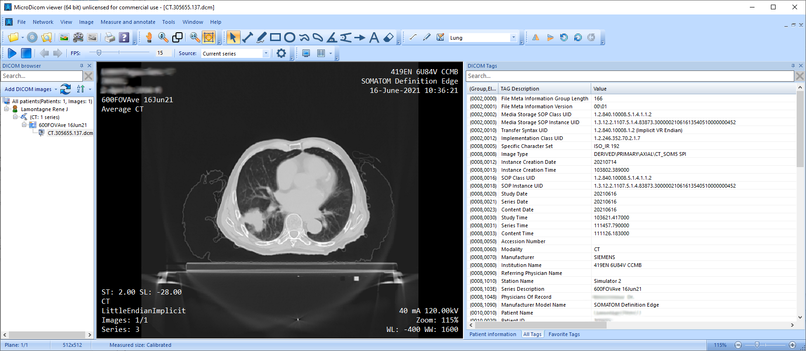
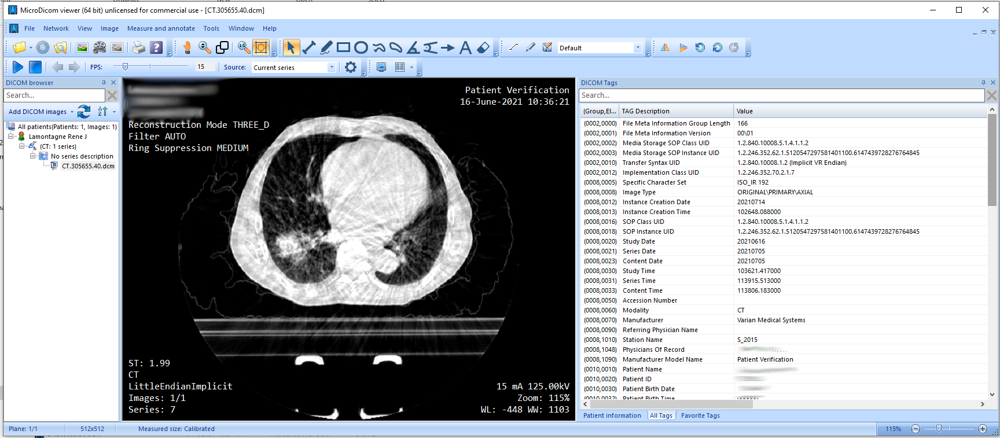
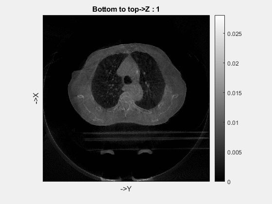

# Clinical data

## 1. Planning CT images

Paitent sliced data has been stored in a series \.dcm files, which can be open with MicroDicom Viewer. The following figure gives an example:




This data is used to build paitent phantom as well as the ground truth in this research. 

## The Varian TrueBeam OBI gives the following data:

## 2. CBCT projections

###  (scanning geometry is  given by the following files):

#### Scan.xml file 

- the distance between the source and detector (origin).
- number of pixels
- pixel size 
- total size of the detector
- Offset of Detector
- Offset of image from origin

#### Reconstruction.xml

- total size of the image 
- number of voxels  
- size of each voxel

###  (scanning data is  given by the following folders):

#### Acquisitions folder

This folder stores the raw projection data, the data was store in \*.xim files. Each paitent have around 895 projections. 

ReadXim function will read the data out according to the xim file names and returns to int32 data. Also, the angle of each projection can also be acquired by reading the header info. 

TIGRE provide 2 methods to retirve the data from xim file:
 1. Using the MATLAB coding "ReadXim.m" function. The code is clear and easy to read, but slow.
 2. Using the C++ complied function "mexReadXim.mexw64". We can't see the code line by line, but this code is super fast!

It's easy to compare the result of these two code, usually, you should be comfort using the mexReadXim function.


The projections of the X-ray fluence for a typical paitent:


The attenuation of the X-ray fluence for a typical paitent:


#### Calibrations folder

This folder contains the blank scan.

The FilterBowtie.xim file or Filter.xim  in the AIR-Half-Bowtie-125KV folder is used as the blank scan.

#### Reconstructions folder

This folder only contains the reconstruction setup, the reconstructed image is in the third section.

## 3. CBCT images

This folder contains the reconstructed image by using the Varian Reconstructor (this software is not accesssible since it's not a free, nor an open-source software).
Therefore we use the TIGRE as our reconstructor.

\.dcm files 

open with MicroDicom Viewer

A CBCT example, you can see the scatter influenced image.

The image reconstructed by the Varian Reconstructor: 




The image reconstructed by the TIGRE in MATLAB: 


## Code

```Varian_DCM_read.m``` read the dcm files and save it to a \*.mat file, this is used for further phantom creation. 

```Varian_TIGRE_Recon.m```load the Varian dataset and perfroms the TIGRE reconstruction.

```compare_planning_CBCT.m``` produce a video to compare the planning CT and CBCT images. 

```compare_Recon.m```load the image data both from the TIGRE and Varian and make video to compare these two different methods.
