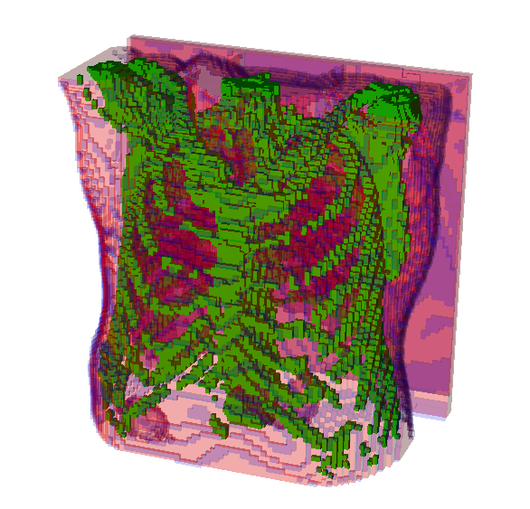
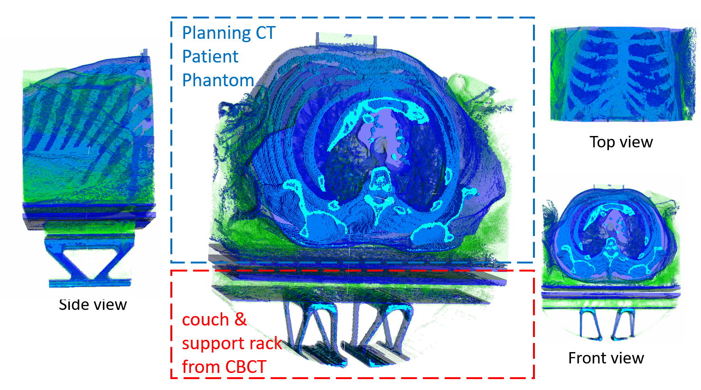

# Generate patient phantom 

### Why do we need to develop a new phantom file? 

### EGS phantom from Planning CT

#### ctCreate command

The EGSnrc has a command to create the paitent phantom according to the planning CT. 

Please see the section 16 CT Based Phantoms/ctcreate at page 110 in this [DOSXYZnrc Users Manual](https://nrc-cnrc.github.io/EGSnrc/doc/pirs794-dosxyznrc.pdf). 




However, this [mortran code](https://github.com/nrc-cnrc/EGSnrc/blob/master/HEN_HOUSE/omega/progs/ctcreate/ctcreate.mortran) got maybe over 25 years old I guess.
The maxium resolution it can achieve is around ~3mm, which is too poor for our project. 

Of course, you can modifie this mortran code and recompile the DOSXYZnrc code. Since I don't have any experience in this "ancient" language, I chooes to code in MATLAB. 

### Our code from Planning CT and CBCT (couch + support rack )

use ``` create.m``` or ``` create.m```


